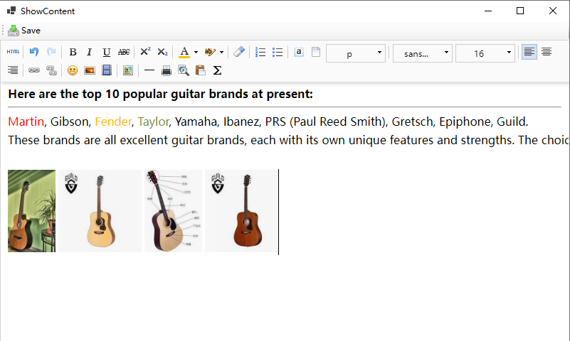

# XsHtmlEditor
Rich Text Editor based on .NET Core WinForms

# API��
### 1、Set editor content
```cs
htmlEditor.SetHtmlValue(model.news_content);
```
If you want to set content when the program is initialized, use it like this:
```cs
htmlEditor.OnInited += () =>
            {
                htmlEditor.SetHtmlValue(model.news_content);
            };
```

### 2、Get editor content
```cs
string html = await htmlEditor.GetHtmlValue();
```
You can also only get the text information:
```cs
string text = await htmlEditor.GetTextValue();
```
### 3、Insert HTML content at the cursor position
```cs
htmlEditor.InsertHtml("html code");
```
### 4、Paste Base64 image at the cursor position in the editor
```cs
htmlEditor.PasteImgBase64();
```
You can use the shortcut Shift+V. 
If this shortcut is already in use, please modify the default shortcut in the code.

### 5、Paste images at the cursor position in the editor and submit them to the server
```cs
htmlEditor.ServerUrl = "https://github.com/yibo7/XsHtmlEditor";
```
You can use the shortcut Ctrl+V.
ServerUrl is your own service.


